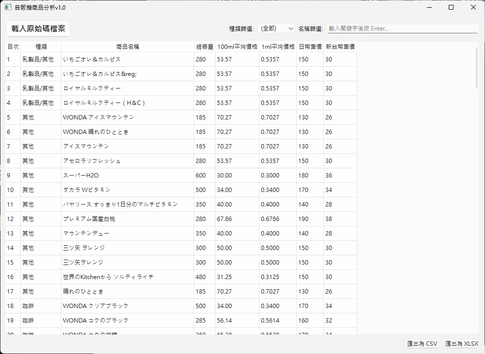

# Vending Machine Product Analyzer (自販機商品分析工具) v1.0

This is a Python-based GUI application designed to parse product information from saved local HTML files of Japanese vending machine operators. It allows users to load multiple files, automatically categorizes the products, calculates various price metrics, and exports the final report to CSV or XLSX format.



## Features

* **Multi-File Processing**: Load and parse multiple HTML source files at once.
* **Smart Format Detection**: Automatically detects the HTML structure for different supported vendors (e.g., `okuraya-kanekiya.com`, `hachiyoh.co.jp`) and applies the correct parsing rules.
* **Advanced Data Analysis**:
    * Automatically cleans and converts data (e.g., "500ml" -> 500).
    * Categorizes products into types like "Coffee," "Tea," "Carbonated," etc., based on keywords.
    * Calculates average price per 1ml and 100ml.
    * Converts JPY prices to TWD based on a predefined exchange rate.
* **Interactive GUI**:
    * Displays all processed data in a clean, sorted table.
    * Filters data by product category or name in real-time.
    * Hides redundant row numbers for a cleaner look.
* **Source Verification**: Right-click on any row to view the original HTML snippet used for parsing, ensuring data integrity.
* **Data Export**: Export the filtered or complete dataset to `.csv` or `.xlsx` files.

## File Structure

```
.
├── Vending-Machine-Data-Analyzer/
│   ├── 爬.py                 # Or your preferred script name, e.g., main.py
│   ├── README.md             # This instruction file
│   ├── requirements.txt      # Required Python libraries
│   └── images/
│       └── screenshot.png    # Application screenshot
└── (Your HTML source files)/
    ├── 1.html
    └── 4.html
```

## Usage

1.  **Install Dependencies**:
    Make sure you have Python installed. Then, install the required libraries using pip:
    ```bash
    pip install -r requirements.txt
    ```

2.  **Prepare HTML Files**:
    Save the source code of the product list pages from the supported vendor websites into `.html` files.
    * **Important**: This tool is designed to parse "view-source" style HTML files. You can typically get this by right-clicking on the webpage in your browser and selecting "View Page Source," then saving the content.

3.  **Run the Application**:
    Execute the Python script from your terminal:
    ```bash
    python 爬.py
    ```

4.  **Load and Analyze**:
    * Click the **"載入原始碼檔案" (Load Source Code File)** button.
    * In the file dialog, select one or more of your saved `.html` files.
    * The application will automatically parse the files, process the data, and display it in the table, sorted by category.

5.  **Verify and Export**:
    * Use the filter options to narrow down the data.
    * Right-click on any row and select **"顯示原始碼片段" (Show Source Snippet)** to verify the parsing accuracy.
    * Click **"匯出為 CSV"** or **"匯出為 XLSX"** to save your report.

## How to Add Support for New Websites

To add a new website format, you need to:

1.  **Analyze the new HTML structure**: Identify the key tags and classes for product containers, names, capacities, and prices.
2.  **Create a new parser function**: Write a new function similar to `parse_format_okuraya` or `parse_format_hachiyoh`.
3.  **Update the detection logic**: Add an `elif` condition in the `load_and_process_files` function to recognize the new file format and call your new parser function.
